<h1 align="center">Hi 👋, I'm Joydeep</h1>
<h3 align="center">A backend and ML developer from India</h3>

  

  

- 🔭 I’m currently working as **Research Intern @ Jadavpur University, India**

- 🌱 I’m currently learning **canvasJs, DehazeNet and DCP**

- 👯 I’m currently working on [Orbital](https://github.com/Joydeep2005Banik/Orbital.git)

- 💬 Ask me about **backend systems and networking**

- 📫 How to reach me: **joydeepbanik41@gmail.com**

- ⚡ Fun fact: **Much of my projects are private :(**

<h3 align="left">Connect with me:</h3>

<h3 align="left">Languages and Tools:</h3>

                   

  
  

